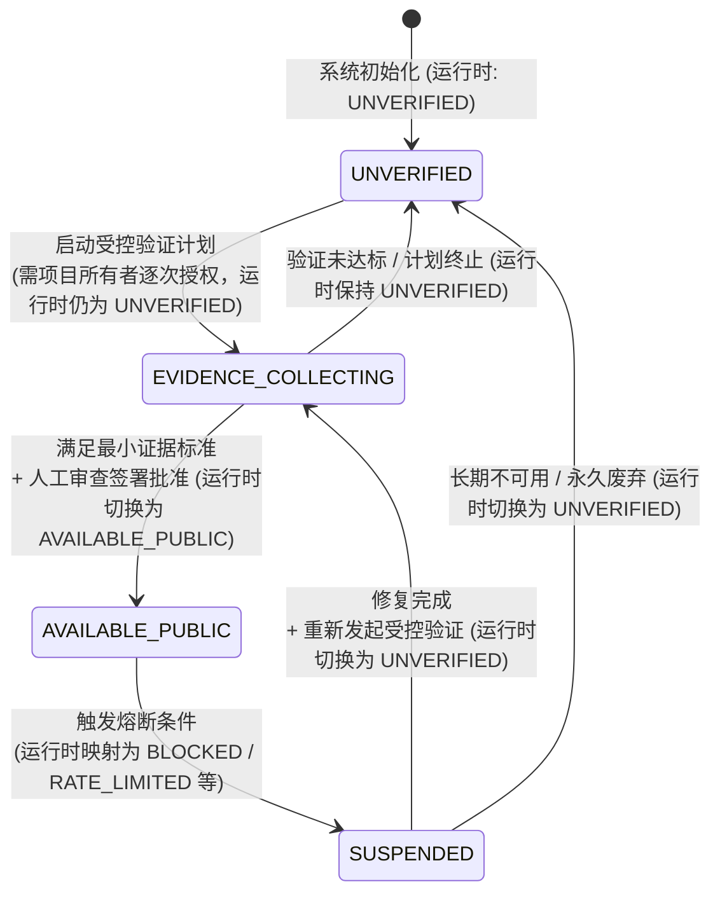

# Phase 4.7.2 — BASIC_PROFILE 公开基础资料能力准入规则设计方案 (Capability Admission Plan)

> **文档定位**：本文档为 BiliProfile Analyzer 的公开基础资料（`BASIC_PROFILE`）能力确立严格的生命周期状态机、最小证据准入标准、受控证据记录规范、人工审查放行与自动化熔断回退规则。
>
> **核心边界与安全原则**：
> 1. **设计先行，纯离线约束**：本文档为纯规则与架构设计，本阶段**不发起任何外部网络请求**，**不提升任何连接器能力状态**。
> 2. **能力状态基线不变**：`BASIC_PROFILE`、`PUBLIC_FOLLOWS`、`PUBLIC_CONTENT` 当前在生产环境连接器中**均严格保持 `UNVERIFIED`**，所有调用一律返回 `data: null` 与 `UNVERIFIED_BLOCKED`。
> 3. **字段观察不等于能力放行**：Phase 4.6.1 的单次受控验证与历史 `Rec-4.4a ~ Rec-4.9` 均为探索期历史观察记录，不自动构成准入证据，绝不代表该能力已具备长期稳定性或可正式投入生产。
> 4. **零凭据与最小化留存**：严禁引入 Cookie、SESSDATA、Token、登录态或任何绕过机制；严禁持久化 UID、URL、原始响应、响应头、字段原值、授权哈希或工单号。

---

## 1. 当前事实与架构边界 (Current Facts & Boundaries)

```
┌─────────────────────────────────────────────────────────────────────────┐
│                           生产运行时连接器边界                           │
│  src/lib/connectors/bilibili-public-connector.ts                        │
│                                                                         │
│  ┌─────────────────────────┐       ┌─────────────────────────────────┐  │
│  │ BASIC_PROFILE           │ ───▶  │ 状态: UNVERIFIED (门控拦截)     │  │
│  │                         │       │ 返回: data: null               │  │
│  └─────────────────────────┘       └─────────────────────────────────┘  │
│  ┌─────────────────────────┐       ┌─────────────────────────────────┐  │
│  │ PUBLIC_FOLLOWS          │ ───▶  │ 状态: UNVERIFIED (门控拦截)     │  │
│  │                         │       │ 返回: data: null               │  │
│  └─────────────────────────┘       └─────────────────────────────────┘  │
│  ┌─────────────────────────┐       ┌─────────────────────────────────┐  │
│  │ PUBLIC_CONTENT          │ ───▶  │ 状态: UNVERIFIED (门控拦截)     │  │
│  │                         │       │ 返回: data: null               │  │
│  └─────────────────────────┘       └─────────────────────────────────┘  │
└─────────────────────────────────────────────────────────────────────────┘
```

1. **三项能力初始基线统一**：`BASIC_PROFILE`、`PUBLIC_FOLLOWS`、`PUBLIC_CONTENT` 当前在生产代码与连接器注册表（`DEFAULT_PRODUCTION_REGISTRY`）中均处于 `UNVERIFIED` 状态；
2. **当前生产调用行为**：因当前所有能力均为 `UNVERIFIED`，调用任何提取方法均在入口门控处被拦截，**严格返回 `data: null` 与 `UNVERIFIED_BLOCKED`**，绝不发起外部请求；
3. **`IMPLEMENTATION_NOT_AVAILABLE` 语义边界**：只有在未来某项能力经 Phase 4.9 人工审查批准后设置为 `AVAILABLE_PUBLIC`、但对应生产提取实现尚不存在时，才返回 `IMPLEMENTATION_NOT_AVAILABLE`（`data: null`）；当前阶段绝不返回该状态，且任何情况下绝不伪造数据；
4. **历史观察记录效力定位**：历史记录 `Rec-4.4a` 至 `Rec-4.10` 及 Phase 4.6.1 仅证明特定单次响应在内存中通过了字段契约，属于研发探索期的**历史观察记录**，**不自动构成正式的 3 份独立准入证据**。

---

## 2. 运行时状态枚举与生命周期治理阶段 (Runtime Enums vs. Governance Stages)

### 1. 严格区分运行时枚举与治理概念

为确保文档表述与代码实现完全一致，严格区分以下两个维度：

1. **代码运行时枚举（`CapabilityStatus`）**：
   - 严格以 [`src/types/connector.ts`](file:///c:/Users/Qyin/Desktop/应用中心/学习/分析目标/src/types/connector.ts) 中定义的实际类型为准：
     ```typescript
     export type CapabilityStatus =
       | "UNVERIFIED"
       | "PAGE_REACHABLE"
       | "AVAILABLE_PUBLIC"
       | "UNAVAILABLE_PRIVATE"
       | "UNAVAILABLE_UNKNOWN"
       | "RATE_LIMITED"
       | "BLOCKED"
       | "REDIRECTED_NOT_FOLLOWED"
       | "NETWORK_ERROR"
       | "UNSUPPORTED"
       | "SKIPPED_NOT_CONFIGURED"
       | "SKIPPED_INVALID_CONFIGURATION";
     ```
   - 生产连接器入口门控逻辑：当且仅当能力状态为 `AVAILABLE_PUBLIC` 时放行；其余所有状态均拦截并返回 `data: null`。

2. **准入与治理生命周期概念（Governance Lifecycle Stages）**：
   - `EVIDENCE_COLLECTING`（证据采集中阶段）和 `SUSPENDED`（熔断暂停阶段）是**准入与运维流程中的治理阶段概念**，**不是当前代码中的运行时枚举**。

### 2. 治理阶段与运行时状态映射矩阵

| 准入与治理阶段 | 对应运行时 `CapabilityStatus` 枚举 | 生产 Connector 行为 | 允许的系统行为 |
| :--- | :--- | :--- | :--- |
| **`UNVERIFIED`** (初始基线) | `"UNVERIFIED"` | 拦截调用，返回 `data: null` (`UNVERIFIED_BLOCKED`) | 允许进行离线测试、合成夹具校验；严禁生产采集 |
| **`EVIDENCE_COLLECTING`** (证据采集阶段) | `"UNVERIFIED"` (生产注册表保持未放行) | 拦截调用，返回 `data: null` (`UNVERIFIED_BLOCKED`) | 允许在所有者逐次显式授权下执行单次受控探针，沉淀脱敏证据记录；**严禁生产采集** |
| **`AVAILABLE_PUBLIC`** (准入放行阶段) | `"AVAILABLE_PUBLIC"` | 允许执行生产采集并返回结构化数据（若已实现） | 允许任务流水线受控调用；必须持续监控异常与风控指标 |
| **`SUSPENDED`** (熔断暂停阶段) | 映射为现有阻断枚举：`"BLOCKED"` / `"RATE_LIMITED"` / `"REDIRECTED_NOT_FOLLOWED"` / `"NETWORK_ERROR"` | 立即降级拦截，返回 `data: null` | 停止生产调用；允许进行离线诊断与修复后的受控探针复测 |

### 3. 治理生命周期流转图 (Lifecycle State Diagram)



### 4. 熔断与回退规则的实施边界说明

> **重要说明**：
> 1. 本文档定义的自动熔断与降级规则属于**架构设计规范**；
> 2. 任何将自动熔断逻辑接入生产 Connector 的代码改造，**仅能在未来获批的实施阶段（如 Phase 4.10）作为生产功能加入**；
> 3. 本阶段（Phase 4.7.2）为纯离线设计，**严禁修改任何生产代码、连接器注册表或类型定义**。

---

## 3. BASIC_PROFILE 最小证据标准 (Minimum Evidence Criteria)

准入评估严格限制于当前已定义的 3 个最小公开基础字段：

| 字段名称 | 允许类型 | 字段通过判定条件 | 异常与缺失处理规则 |
| :--- | :--- | :--- | :--- |
| **`displayName`** | `string` | 命中明确结构锚点（如 `og:title` 或 `h1.h-name`）；非空；无控制字符；无 HTML 标签/尖括号。 | 仅普通 `<title>` 视为未通过；缺失时标记 `UNAVAILABLE`，不可伪造占位值。 |
| **`avatarUrl`** | `string` | 命中结构锚点（如 `og:image` 或 `img.h-avatar`）；符合 `http`/`https`/`//` 语法；无 `user:pass` 认证信息；无尖括号/空格。 | **仅验证 URL 语法与安全协议，严禁下载图片二进制**；协议不合规标记为 `PARSE_REJECTED`。 |
| **`signature`** | `string` | 命中结构锚点（如 `meta.description` 或 `div.h-sign`）；非空；无控制字符；无 HTML 标签/尖括号。 | 用户未设置个性签名时属于合法缺失，记录为 `PARSED_EMPTY_OR_ABSENT`，形成 `PARTIAL` 结果。 |

### 准入门槛规范 (Admission Gateways)
> **说明**：以下标准仅作为系统准入的技术门槛，绝非对 Bilibili 外部服务可用性或稳定性的任何承诺。

1. **独立样本要求**：必须在 Phase 4.8 重新在 **至少 3 个独立时间窗口**（时间间隔 $\ge 30$ 分钟）或 **3 个独立授权公开样本** 下完成受控单次验证；
2. **有效准入样本资格**：
   - **只有合规的 `SUCCESS` 或 `PARTIAL` 记录可计入准入样本集**；
   - **`PARTIAL` 判定边界**：仅允许 `signature` 字段合法缺失（`PARSED_EMPTY_OR_ABSENT`）；`displayName` 与 `avatarUrl` 必须达到 `PARSED_NONEMPTY` 且 100% 通过字段契约；
   - 任何发生 `errorCategory !== "NONE"`（如限流、超限、重定向、契约被拒）的记录均为 `FAILED`，绝不可计入准入样本集；
3. **合格率要求**：
   - 准入样本集中字段契约合法性校验通过率必须为 **100%**；
   - 零凭据依赖性必须为 **100%**（0 次携带 Cookie/Token，0 次请求登录态）；
   - 响应体积超限率必须为 **0%**（所有样本均严格 $\le 64\text{ KiB}$）；
   - 敏感信息泄露率为 **0%**（0 次记录或持久化原始响应与原值）；
4. **零伪造原则**：绝对严禁将缺失的空值伪造成成功，严禁使用推断值或 Mock 占位值填补。

---

## 4. 受控验证记录格式 (CapabilityEvidenceRecord Model)

为确保受控采样的审计完备性与绝对隐私安全，补全 `CapabilityEvidenceRecord` 规范模型：

### 1. 允许持久化的脱敏元数据模型

```typescript
export type CapabilityEvidenceOutcome =
  | "SUCCESS"
  | "PARTIAL"
  | "FAILED";

export type CapabilityEvidenceErrorCategory =
  | "REDIRECTED"
  | "RATE_LIMITED"
  | "BLOCKED"
  | "NON_HTML"
  | "BYTE_LIMIT_EXCEEDED"
  | "CONTRACT_REJECTED"
  | "NETWORK_ERROR"
  | "NONE";

export interface CapabilityEvidenceRecord {
  /** 记录唯一审计标识 (不可逆随机 ID，如 evidence-rec-001) */
  evidenceId: string;
  /** 对应能力名称 */
  capability: "BASIC_PROFILE";
  /** 验证执行时间戳 (严格 ISO 8601) */
  verifiedAt: string;
  /** 探针与规则版本 */
  probeVersion: string;
  contractVersion: string;
  /** 外部网络请求数 (必须严格为 1) */
  requestCount: 1;
  /** 准入判定结果 (仅 SUCCESS 与 PARTIAL 可计入准入样本) */
  outcome: CapabilityEvidenceOutcome;
  /** 错误分类 (成功时为 NONE) */
  errorCategory: CapabilityEvidenceErrorCategory;
  /** 传输层受控观测结论 */
  transportOutcome: {
    isReachable: boolean;
    httpStatus: number;
    contentType: string; // 仅限主类型，如 "text/html"
    noRedirect: boolean;
    noRateLimit: boolean;
  };
  /** 流式安全合规结论 */
  streamSecurity: {
    bytesProcessed: number;
    hitByteLimit: boolean; // 必须为 false (<= 64 KiB)
    maxBufferObserved: number; // 必须 <= 2048
  };
  /** 最小字段脱敏状态 */
  fieldStatus: {
    displayName: "PARSED_NONEMPTY" | "PARSED_EMPTY_OR_ABSENT" | "PARSE_REJECTED" | "NOT_OBSERVED";
    avatarUrl: "PARSED_NONEMPTY" | "PARSED_EMPTY_OR_ABSENT" | "PARSE_REJECTED" | "NOT_OBSERVED";
    avatarUrlSyntaxValid: boolean;
    signature: "PARSED_NONEMPTY" | "PARSED_EMPTY_OR_ABSENT" | "PARSE_REJECTED" | "NOT_OBSERVED";
  };
  /** 数据最小化审计通过标记 */
  dataMinimizationGuaranteed: true;
  /** 单次操作者显式授权确认 (严禁记录工单号/哈希/身份) */
  authorization: {
    authorizationType: "OWNER_EXPLICIT_PER_RUN";
    authorizationConfirmed: true;
  };
}
```

### 2. 严禁保存的内容清单 (Prohibited Data Checklist)

在任何证据记录、日志或持久化载体中，**绝对禁止记录以下内容**：
- ❌ 真实 UID、用户名或账号主页 URL；
- ❌ 昵称、个性签名、头像图片地址的明文文本或图片内容；
- ❌ 字段原值的任何可逆哈希或掩码片段；
- ❌ 原始 HTML 正文、DOM 节点、CSS 选择器命中片段；
- ❌ 响应头（`Set-Cookie`、`Server`、`ETag` 等）；
- ❌ 任何环境变量值、密钥、数据库连接串或授权 Token；
- ❌ 授权工单号、授权凭据哈希、操作者身份或任何可关联标识。

---

## 5. 放行与回退规则 (Admission & Rollback Rules)

### 1. 人工审查放行流程与判定清单 (Manual Review & Admission Gate)
1. **证据集完备性检查**：系统汇总在 Phase 4.8 沉淀的 `CapabilityEvidenceRecord` 集合（不少于 3 份独立合规记录）；
2. **每条拟计入证据集的记录必须同时满足以下完整准入清单**：
   - `requestCount === 1`（单次受控请求，严格为 1）；
   - `errorCategory === "NONE"`（无传输与协议层错误）；
   - `outcome` 为 `SUCCESS` 或符合规则的 `PARTIAL`；
   - `bytesProcessed <= 65536`（严格处于 64 KiB 安全流式硬顶内）；
   - `hitByteLimit === false`（未触及或突破流式截断上限）；
   - `maxBufferObserved <= 2048`（滑动窗口内存峰值严格受控）；
   - `dataMinimizationGuaranteed === true`（100% 通过数据最小化与防泄露断言）；
   - `displayName` 与 `avatarUrl` 均为 `PARSED_NONEMPTY`；
   - `avatarUrlSyntaxValid === true`（头像地址符合安全协议与 URL 语法）；
   - `signature` 仅可为 `PARSED_NONEMPTY` 或 `PARSED_EMPTY_OR_ABSENT`（合法缺失形成 PARTIAL）；
   - **不得存在任何凭据依赖**（0 Cookie / 0 Token / 0 登录态）或**任何敏感信息留存**；
3. **人工签署批准**：由项目所有者明确审查并签署审查结论，手动将代码中 `BASIC_PROFILE` 的注册状态变更为 `AVAILABLE_PUBLIC`；
4. **禁止自动化提升**：严禁任何脚本或探针在执行成功后自动修改状态机。

### 2. 自动化回退与熔断机制 (Automatic Suspension / Rollback Design)
当能力处于 `AVAILABLE_PUBLIC` 运行时，一旦发生以下任一异常，必须立即触发熔断并降级至 `SUSPENDED` 治理状态（运行时映射为与触发原因相符的既有阻断状态）：
- **熔断场景 1：网络风控触发**（收到 HTTP 429 限流或 403 阻断，运行时映射为 `RATE_LIMITED` 或 `BLOCKED`）；
- **熔断场景 2：页面重构失效**（无法命中既定语义结构锚点，运行时映射为 `BLOCKED`）；
- **熔断场景 3：契约校验失败**（字段中检测到恶意标签、控制字符或非法协议，运行时映射为 `BLOCKED`）；
- **熔断场景 4：凭据依赖变动**（页面需要登录或重定向到 passport 登录页，运行时映射为 `REDIRECTED_NOT_FOLLOWED`）；
- **熔断场景 5：流式超限或网络异常**（处理字节数触及/突破 64 KiB 上限或连接超时，运行时映射为 `BLOCKED` 或 `NETWORK_ERROR`）。

> **回退后行为**：连接器立即停止对外提供该能力的数据，调用一律返回 `data: null`，并记录与触发原因相符的既有运行时阻断状态（`BLOCKED`、`RATE_LIMITED`、`REDIRECTED_NOT_FOLLOWED` 或 `NETWORK_ERROR`），直至问题修复并通过人工再批准；明确这属于未来 Phase 4.10 的实现规则，当前阶段不修改任何代码。

### 3. 能力严格隔离原则 (Strict Capability Isolation)
- `BASIC_PROFILE` 的状态变迁（无论是放行还是回退熔断）**均完全独立**；
- 绝对不得影响 `PUBLIC_FOLLOWS`（关注列表）或 `PUBLIC_CONTENT`（动态内容）的 `UNVERIFIED` 门控状态。

---

## 6. 后续实施阶段顺序 (Subsequent Implementation Sequence)

```
┌─────────────────┐      ┌─────────────────┐      ┌──────────────────┐
│   Phase 4.8     │ ──▶  │   Phase 4.9     │ ──▶  │   Phase 4.10     │
│ 额外受控验证与   │      │ 准入审查与状态   │      │ 任务流水线受控   │
│ 证据记录沉淀     │      │ 人工签署放行     │      │ 最小化接入       │
└─────────────────┘      └─────────────────┘      └──────────────────┘
```

### 1. Phase 4.8 — 额外受控验证与脱敏证据沉淀
- **实施内容**：在所有者按次显式授权下，按“逐次授权、严格单请求、至少 30 分钟间隔、独立时间窗口或独立授权样本”规则执行受控验证，生成符合 `CapabilityEvidenceRecord` 的脱敏记录。
- **完成标准**：
  1. 沉淀至少 3 份合规的独立脱敏证据记录（`outcome` 为 `SUCCESS` 或 `PARTIAL`）；
  2. 零外部网络请求泄露（每次请求严格单次且受控）；
  3. 零生产代码变动，生产能力仍保持 `UNVERIFIED`。

### 2. Phase 4.9 — 准入人工审查与状态放行
- **实施内容**：项目所有者全面审查 Phase 4.8 形成的证据集，核对数据最小化与稳定性指标，决策是否放行 `BASIC_PROFILE`。
- **完成标准**：
  1. 项目所有者签署审查结论报告；
  2. 仅将 `BASIC_PROFILE` 状态在连接器注册表中提升为 `AVAILABLE_PUBLIC`；
  3. `PUBLIC_FOLLOWS` 与 `PUBLIC_CONTENT` 严格保持 `UNVERIFIED`。

### 3. Phase 4.10 — 任务流水线最小化受控接入
- **实施内容**：在 `BASIC_PROFILE` 获批后，将其接入分析任务的最小数据提取流水线，实现任务执行中的安全调用与降级兜底。
- **完成标准**：
  1. 流水线在能力可用时提取 3 个基础字段并脱敏写入任务快照；
  2. 流水线在能力异常或缺失时 100% 优雅降级（使用默认匿名标识与通用头像）；
  3. 绝对不接入关注列表、公开动态、AI 生成或前端 UI 未授权展示。
