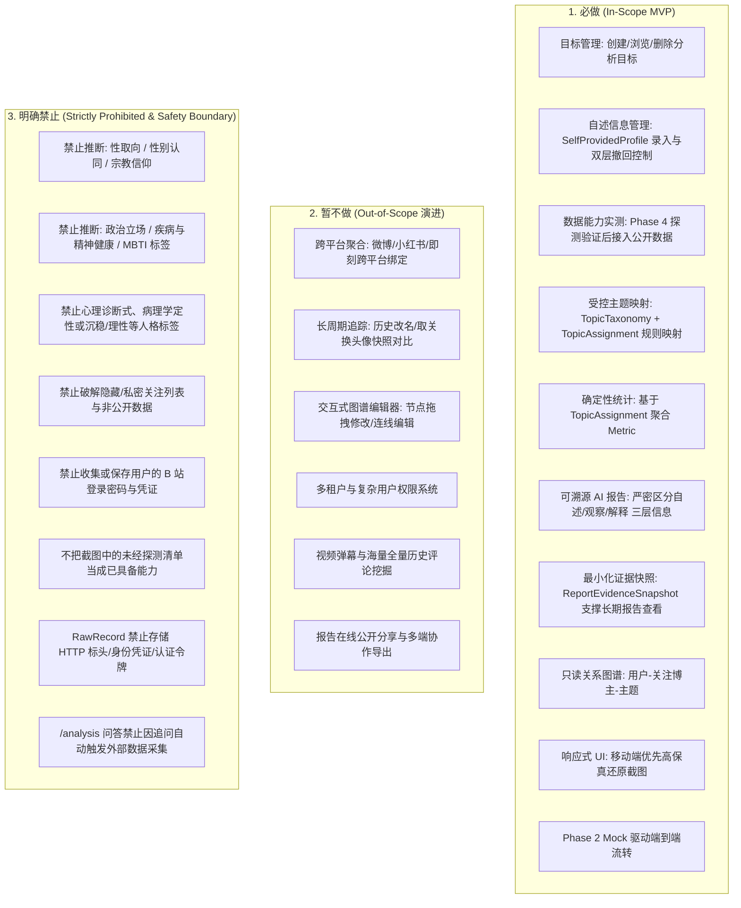
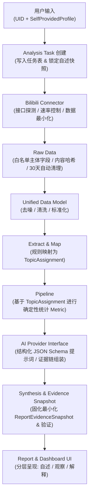
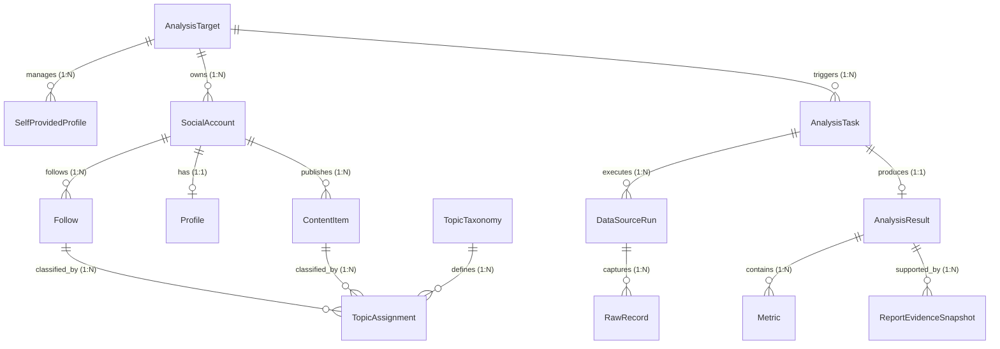
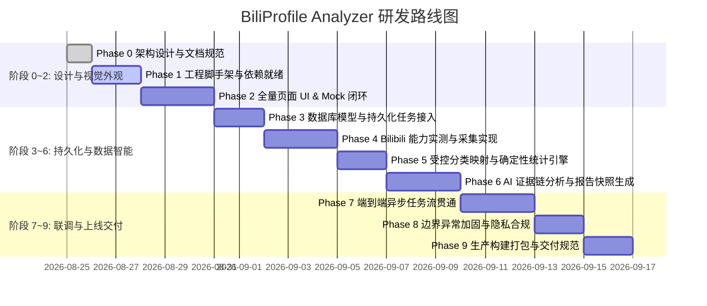

# BiliProfile Analyzer — 项目架构与工程实施方案 (Phase 0.3 修订版)

> **项目名称**：BiliProfile Analyzer  
> **文档版本**：v1.2.0 (Phase 0.3 最终一致性微调基线)  
> **适用对象**：第一次独立完成完整全栈项目的计算机系本科生（注重循序渐进、结构严密、工程清晰、杜绝过早过度设计）  
> **当前阶段**：Phase 0.3 — 架构设计文档（仅做架构与需求设计，不编写业务代码、不初始化脚手架、不调用外部 API）  

---

## 目录

1. [产品定义](#1-产品定义)
2. [MVP 边界与安全红线](#2-mvp-边界与安全红线)
3. [截图深度分析与 UI/UX 设计方向](#3-截图深度分析与-uiux-设计方向)
4. [推荐技术栈及理由](#4-推荐技术栈及理由)
5. [系统整体架构设计](#5-系统整体架构设计)
6. [数据流与任务状态设计](#6-数据流与任务状态设计)
7. [概念数据模型与隐私设计](#7-概念数据模型与隐私设计)
8. [Bilibili Connector 设计原则与验证矩阵](#8-bilibili-connector-设计原则与验证矩阵)
9. [AI Pipeline 机制与严格推理边界](#9-ai-pipeline-机制与严格推理边界)
10. [页面结构与每页 MVP 职责](#10-页面结构与每页-mvp-职责)
11. [分阶段开发计划 (Phase 0 ~ Phase 9)](#11-分阶段开发计划-phase-0--phase-9)
12. [核心技术风险与应对策略](#12-核心技术风险与应对策略)
13. [待确认问题与推荐默认决策](#13-待确认问题与推荐默认决策)

---

## 1. 产品定义

### 1.1 一句话定义
**BiliProfile Analyzer** 是一款面向普通 Bilibili 用户的公开数据画像分析 Web App。用户可输入目标用户的 **UID 或主页链接**，并可选择由被分析者本人补充提供受控自述信息；系统在后续阶段采集可公开访问且经过实际探测验证的数据，经过清洗、标准化与确定性统计分析，并由 AI 进行多维度的客观语义解释与归纳，最终生成一份**数据可溯源、指标有据可查、严格区分事实与推论的结构化用户兴趣与行为画像报告**。

### 1.2 输入、输出与核心价值
- **系统输入**：
  1. **公开标识**：Bilibili 用户的公开数字 UID（如 `12345678`）或个人空间主页 URL。
  2. **用户自述信息（可选）**：被分析者本人主动录入的 `SelfProvidedProfile`（包含目标、学习方向、专业职业、兴趣标签、分析问题、补充背景，且附带字段级授权范围与授权确认承诺）。
- **系统输出**：
  1. 结构化基础档案与社交统计（昵称、签名、公开关注量等概览）。
  2. 确定性分类统计图表（基于受控分类体系 `TopicTaxonomy` 与映射记录 `TopicAssignment` 计算的关注领域分布条形图、时段直方图、兴趣多样性指数）。
  3. AI 驱动的客观兴趣画像报告（融合自述信息与公开数据观察，清晰呈现证据链与不确定性声明）。
  4. 只读关系网络（用户 — 关注博主 — 受控主题三元拓扑关系）。
- **核心价值**：将散落、非结构化的公开社交数据与授权自述信息，通过“程序确定性统计 + AI 语义归纳”的工程链路，沉淀为高信噪比、条理清晰且事实有据的结构化认知画像。

### 1.3 核心定位：普通用户画像 vs UP 主分析
必须在架构之初明确：**本项目第一版严格面向普通 B 站用户（内容受众/消费者）的公开画像分析，不以 UP 主（创作者/主播）商业化运营分析为目标**。

| 维度 | 普通用户画像分析 (本项目定位) | UP 主运营数据分析 (非本项目目标) |
| :--- | :--- | :--- |
| **分析主体** | 99% 的普通看视频、发动态、关注博主的平台用户 | 少数内容创作者、机构号、头部网红 |
| **核心数据源** | 公开关注列表、公开动态、公开投稿标题、个人自述 | 视频播放量走势、投币点赞转化率、粉丝增长漏斗、弹幕热词 |
| **核心诉求** | 理解其“兴趣偏好、涉猎领域、内容消费诉求、学习方向” | 评估其“商业变现价值、爆款内容机制、带货能力、受众画像” |
| **工程特点** | 数据轻量、依赖受控分类聚合与文本理解、单次深度画像 | 数据海量、需高频持续监控、依赖大数据实时流计算 |

---

## 2. MVP 边界与安全红线

为了保证计算机本科生在有限精力内能够**高质量独立闭环**，必须设定极其清晰的功能边界，坚决杜绝需求蔓延与不合规设计。



### 2.1 必做功能 (In-Scope)
1. **分析目标（AnalysisTarget）管理**：支持录入 B 站 UID / Space 链接，创建与管理分析对象。
2. **被分析者本人自述信息（SelfProvidedProfile）管理**：
   - 仅限被分析者本人主动填写（当前目标、学习方向、专业/职业方向、兴趣标签、希望获得的分析问题、补充背景）。
   - 每个字段独立具备 `allowedForAnalysis`（是否允许分析使用）与 `consentScope`（授权范围，区分“仅本次任务”与“后续任务也可使用”）。
   - 用户可随时编辑、撤回授权（停止未来任务使用）或彻底删除字段及关联历史派生数据。
   - `additionalContext` 界面强制展示敏感信息防范提示；操作者勾选确认“我有权提供并授权本次使用这些自述信息”。
3. **数据能力探测与受控采集**：在 Phase 4 依照严格的验证矩阵完成实测验证后，接入可获取的公开数据。
4. **数据最小化与清洗**：将原始 JSON 按字段白名单标准化为领域 DTO，严格过滤非必要元数据与敏感凭证。
5. **受控主题映射（TopicAssignment）与确定性统计**：基于受控分类体系 `TopicTaxonomy`，通过确定性规则（`method = RULE_BASED / MANUAL`）生成映射记录，并据此计算统计指标，严禁大模型随意生成统计标签。
6. **最小化证据快照（ReportEvidenceSnapshot）与分层 AI 报告**：
   - 提取最小化支撑证据固化为 `ReportEvidenceSnapshot`，支撑报告长期查阅证据，解决 `RawRecord` 30 天自动清理后的证据链存续问题。
   - 严格区分“用户自述”、“公开数据观察”与“AI 解释或假设”。
   - 每条 AI 结论必须包含 `claim`、`evidenceIds`、`scope`、`uncertainty` 四要素，且通过服务端证据快照校验。
7. **响应式 5 大页面还原**：实现 `/dashboard`、`/entities`、`/graph`、`/analysis`、`/settings`，优先保证移动端体验。
8. **Phase 2 Mock 数据全链路跑通**：在不依赖数据库和外部网络的前提下，先行完成前端所有交互与视图闭环。

### 2.2 暂不做功能 (Out-of-Scope)
1. **跨平台账号聚合**：第一版仅深耕 Bilibili，暂不引入其他平台。
2. **全网评论区深度溯源**：B 站无集中公开的“用户全量历史评论”接口，普通用户评论分散在海量视频下，抓取成本极高且极易被封禁，MVP 不做。
3. **图谱交互编辑**：关系图仅作为数据成果的可视化呈现（只读），不做节点拖拽编辑、属性修改等复杂编辑器功能。
4. **长周期历史快照比对**：暂不实现按周/按月的历史关注变化对比。
5. **报告公开分享功能**：删除 MVP 中的报告在线分享与导出功能，留作后续版本评估项。

### 2.3 明确禁止与安全红线 (Strictly Prohibited)
> [!CAUTION]
> **安全与伦理红线（不可逾越）**：
> 1. **严禁敏感个人属性推断**：系统**绝对禁止**根据用户的关注或言论推断其**性取向、性别认同、宗教信仰、政治立场、种族/民族、身体疾病、心理健康状况/精神病理诊断、MBTI 性格测试标签**等敏感高风险个人属性。
> 2. **严禁心理诊断式与人格标签定性**：禁止 AI 在报告中使用“抑郁倾向”、“情感障碍”、“焦虑症候”等精神诊断措辞；**禁止使用“沉稳、理性、内向”等无依据的人格标签**。如需描述，仅能描述“公开文本样本呈现的表达特征”，且必须引用具体样本并说明不确定性。
> 3. **截图 4 反面案例声明**：视觉参考截图 4 中展示了“根据关注推断 MBTI 与性取向”的报告内容，**本项目明确将其定性为不可接受的高风险设计，在 MVP 中严格禁止，AI 提示词与安全过滤网关必须设立硬性拦截**。
> 4. **禁止侵犯用户隐私与破解行为**：当目标用户在 B 站开启“隐藏关注列表”或“仅自己可见”时，系统坚决不尝试任何黑产撞库或漏洞破解，必须如实提示“该用户已设置隐私保护，关注列表不可见”，并优雅降级为基于公开动态分析。
> 5. **禁止保存密码与授权凭证**：系统绝对不收集、不保存任何用户的 Bilibili 账号密码。
> 6. **原始数据最小化存储红线**：`RawRecord` 严禁存储完整 HTTP 响应头、身份凭据、授权头或任何认证令牌；仅保存必要主体字段、采集时间戳、状态与内容哈希。
> 7. **禁止在问答中自动触发外部抓取**：`/analysis` 问答对话功能必须严格限定于读取当前选定 `AnalysisTask` 的报告快照与 `ReportEvidenceSnapshot`，**绝对禁止因用户的一次对话追问而自动触发新的外部网络爬虫请求**。
> 8. **不把截图中的数据采集清单当作已被验证的能力**：截图 1 气泡中罗列的诸多项目仅为原型参考，绝不代表真实接口能力。所有数据获取必须在 Phase 4 探测验证。

---

## 3. 截图深度分析与 UI/UX 设计方向

我们对提供的 4 张视觉截图进行了逆向工程与交互逻辑拆解，提取出产品的页面架构与设计规范：

```
┌─────────────────────────────────────────────────────────────────────────┐
│                           UI / UX 页面映射体系                           │
├──────────────────┬──────────────────┬─────────────────┬─────────────────┤
│ 截图 1: AI分析师 │ 截图 2: Dashboard│ 截图 3: 实体详情│ 截图 4: 报告结论│
│   (/analysis)    │   (/dashboard)   │   (/entities)   │(/analysis/[id]) │
├──────────────────┼──────────────────┼─────────────────┼─────────────────┤
│ • 目标下拉切换   │ • 3x2 核心指标格 │ • 顶部快捷操作  │ • 结构化排版卡片│
│ • 任务状态流气泡 │ • 最近更新动态   │ • 7 个分类子Tab │ • 三层信息严格区分│
│ • 智能提问输入栏 │ • 最近分析任务   │ • 关注分布条形图│ • 证据链与置信度│
│   (只读当前快照) │ • 分类概览胶囊组 │ • 自述信息卡片  │ (剔除敏感推断)  │
├──────────────────┴──────────────────┴─────────────────┴─────────────────┤
│                       全局底部五栏导航 (Bottom TabBar)                   │
│         [总览]      [实体]      [关系图]      [分析]      [设置]         │
└─────────────────────────────────────────────────────────────────────────┘
```

### 3.1 四张截图深度逆向分析

#### 截图 1：移动端“AI 分析”工作台 (`/analysis`)
- **视觉与交互元素**：
  - **顶部导航**：`← 返回` 按钮，主标题 `AI 分析师`，右侧为目标主体下拉选择器（如当前选择 `YJ ˇ`）。
  - **任务触发与执行流**：
    - 右侧用户指令气泡：`全面综合分析该目标`。
    - 左侧 AI 执行状态卡片：青色状态图标 `|`，展示流水线正在执行的阶段提示（如正在收集数据、正在进行统计计算等）。
  - **交互式对话输入栏**：底部常驻悬浮输入框，提示文字为 `向 AI 提问，它会自动调用目标数据...`，左侧带 `+` 操作扩展，右侧为发送按钮。**明确：问答仅基于当次分析已锁定的数据与证据快照，绝不触发新的外部网络请求**。
  - **历史记录区**：下方展示 `历史分析` 列表（支持点击 `全部` 查看归档）。
  - **底部全局导航**：五栏 TabBar（总览、实体、关系图、分析、设置），当前高亮“分析”。

#### 截图 2：总览 Dashboard (`/dashboard`)
- **视觉与交互元素**：
  - **顶部标题**：`总览`。
  - **3x2 核心指标卡片矩阵**：
    - `实体` (1) | `社交账号` (3) | `关注条目` (99)
    - `活跃记录` (0) | `截图存档` (9) | `AI 分析` (1)
  - **动态与最近活动列表**：
    - `最近更新`（展示头像、名称、相对时间，支持点击 `全部 >`）。
    - `最近分析`（展示如 `全面综合分析该目标`，相对时间）。
  - **分类概览胶囊标签组**：展示实体分类分布（如 `人物 (1)`、`地点 (0)`、`物品 (0)`、`组织 (0)`、`事件 (0)`）。

#### 截图 3：实体详情与关注分布分析 (`/entities` / `/entities/[id]`)
- **视觉与交互元素**：
  - **顶部操作金刚区**：`🔗 关系图`、`✏️ 编辑`、`✦ AI 分析`（突出高亮主操作）、`🗑️ 删除` 胶囊按钮。
  - **7 个分类 Sub-Tabs**：基础信息/自述信息、关注账号（Badge: `3`，当前高亮）、时间线、互动、快照、关联、分析历史。
  - **核心内容卡片 — 关注账号类型分布**：
    - 标题：`🏷️ 关注账号类型分布`。
    - 横向条形统计图：展示基于受控分类体系 `TopicTaxonomy` 与映射记录 `TopicAssignment` 的各细分领域占比与计数（如 *学习/教育* 19、*个人博主* 6 等），进度条具有渐变过渡色。

#### 截图 4：AI 深度画像报告结论片段 (`/analysis/[id]`)
- **视觉与交互元素**：展示了 AI 综合分析报告的排版风格，包含证据链条引述与综合结论。
- **设计方向修正与红线坚守**：
  - 截图 4 呈现的“排版样式、证据链列举方式”是极佳的 UI 参考；
  - 但截图 4 中**推断性取向与 MBTI 的具体内容不可取**。本项目在报告内容上坚决替换为：**“用户自述诉求总结”、“学习与知识涉猎方向”、“兴趣与圈层偏好”以及“公开文本表达特征（附样本引用与不确定性说明）”**。

### 3.2 对应页面路由规划
1. `/dashboard`：总览控制台（指标统计卡片、最近分析与更新、分类概览）。
2. `/entities` 与 `/entities/[id]`：实体管理中心与档案详情（包含自述信息录入与授权控制、关注类型分布图表与 7 个 Sub-Tabs）。
3. `/graph`：只读关系图谱（展示用户、关注账号、受控兴趣主题三元关系拓扑）。
4. `/analysis` 与 `/analysis/[id]`：AI 分析师工作台与历史快照报告详情（支持基于已归档证据快照的只读问答）。
5. `/settings`：系统设置（AI 提供商选择、API Key 配置、数据保留与隐私清除、本地 Mock 开关）。

### 3.3 视觉风格与响应式设计规范
- **设计语言 (Design System)**：
  - **主色调**：温暖陶土棕（Terracotta `#B89582` / `#C4A493`）作为背景氛围底色；柔和奶白（`#FDFCFA`）作为内容卡片背景。
  - **强调色**：优雅灰青色（Sage Teal `#4E878C`）作为主操作按钮、高亮 Tab 与图表主色；辅以暖金渐变（`#4E878C` 到 `#D4A373`）。
  - **形态与质感**：统一大圆角卡片（`rounded-2xl` ~ `rounded-3xl`，16px~24px），配合柔和弥散阴影（Soft Shadows）。
- **响应式适配策略 (Mobile-First)**：
  - **移动端（< 768px）**：优先保证手机端单列纵向流式排版，底部常驻 5 栏 TabBar，完全还原截图体验。
  - **桌面端（>= 768px / 1024px）**：自适应切换为“左侧紧凑侧边导航栏 + 中右侧响应式网格工作台”，避免宽屏留白。
- **关键认知**：**截图是 UI/UX 视觉与交互的原型规范，绝非后端数据能力的现实证明**。

---

## 4. 推荐技术栈及理由

针对计算机系本科生“第一次独立完成全栈项目”的实际情况，技术选型必须遵循**“零心智割裂、渐进式演进、开箱即用、避免过早基建”**的原则：

```
┌─────────────────────────────────────────────────────────────────────────┐
│                      推荐轻量全栈技术栈组合                             │
├───────────────────────┬─────────────────────────────────────────────────┤
│ 前端与全栈框架        │ Next.js 15+ (App Router) + React 19 + TypeScript│
├───────────────────────┼─────────────────────────────────────────────────┤
│ 样式与 UI 组件库      │ Tailwind CSS + shadcn/ui (Radix UI 原生可控)    │
├───────────────────────┼─────────────────────────────────────────────────┤
│ 数据可视化            │ Recharts (条形图/分布图) + React Flow (只读图谱)│
├───────────────────────┼─────────────────────────────────────────────────┤
│ 数据库与持久化        │ PostgreSQL + Prisma ORM (前期开发期可用 SQLite) │
├───────────────────────┼─────────────────────────────────────────────────┤
│ AI 集成               │ 统一 IAIProvider 接口封装 (Gemini / OpenAI 适配)│
└───────────────────────┴─────────────────────────────────────────────────┘
```

### 4.1 技术选型与解决的核心问题

1. **Next.js (App Router) + TypeScript**：
   - *解决什么问题*：彻底消灭“前端 React + 后端 Python/FastAPI”在初学阶段带来的两套开发环境、跨域 CORS 配置、接口重复定义、端口管理繁琐等痛点。
   - *为什么适合初学者*：统一使用 TypeScript 语言，全栈类型共享；前端组件、后端 API（Route Handlers）统一在一个工程中运行，一条 `npm run dev` 命令直接启动整套系统。
2. **Tailwind CSS + shadcn/ui**：
   - *解决什么问题*：避免手写庞杂且易冲突的 CSS 文件，快速复现截图中的大圆角、毛玻璃与精致陶土配色。
   - *为什么适合初学者*：shadcn/ui 采用“源码直接拷贝到项目”的方式，没有黑盒依赖，学生可完全自主阅读、修改每一个组件的 Tailwind 类名与交互逻辑。
3. **Recharts + React Flow**：
   - *解决什么问题*：Recharts 以极简的 JSX 声明式语法绘制截图 3 中的横向条形分布图；React Flow 以声明式节点渲染只读关系图。
   - *为什么适合初学者*：Recharts 深度契合 React 状态驱动理念，零上手门槛。
4. **Prisma ORM + PostgreSQL / SQLite**：
   - *解决什么问题*：避免初学者手写 SQL 产生的语法错误与类型不安全问题。
   - *为什么适合初学者*：Prisma Schema 语法如同清晰的数据字典，自动生成端到端的 TypeScript 类型提示。

### 4.2 极其关键的工程原则：何时才引入数据库与持久化？
> [!IMPORTANT]
> **“界面先行，持久化后移”演进路线**：
> - **Phase 1 ~ Phase 2 阶段绝对不连接真实数据库**！全部使用基于 TypeScript 内存对象的 `MockDataRepository`，并在此阶段模拟任务进度动画。
> - **Phase 3 正式引入 Prisma 与数据库**：将任务状态、实体、自述信息、主题映射记录与分析快照持久化到数据库任务表中。
> - **明确要求**：**不得把 Node.js 内存状态机作为可部署的真实任务方案**。从 Phase 3 开始，所有任务生命周期必须由持久化数据库驱动。

### 4.3 坚决避免过早引入的沉重基础设施
第一版坚决**禁止引入以下过度工程化组件**：
- ❌ **Docker / Docker Compose**：本地开发直接使用本地 Node.js 运行时即可，避免初学者被容器卷挂载、网络端口映射等运维问题绊住（仅在最后 Phase 9 交付时提供可选部署脚本）。
- ❌ **外部消息队列 (Redis / RabbitMQ / Kafka)**：异步任务通过持久化任务表与轮询/SSE 驱动，绝不引入外部队列中间件。
- ❌ **微服务架构 (Microservices)**：单体全栈架构对于 MVP 而言调试最容易、打包最简单、维护成本最低。
- ❌ **复杂的 CI/CD 与多容器编排**：杜绝一切增加配置复杂度的工具。

---

## 5. 系统整体架构设计

系统采用**清晰的松耦合分层架构**，确保各层职责单一，且可在后续平滑升级：



### 5.1 核心解耦原则：Connector 与 AI Analysis 彻底隔离
- **Connector 专职化**：`BilibiliConnector` 仅负责处理平台特异性逻辑（网络请求、协议解析、字段白名单提取），输出与业务解耦的标准化数据对象。
- **AI 模块纯净化**：`AIEngine` 只接收由 `StatsEngine` 计算出的“统计指标摘要”、清洗后的文本证据样本以及用户授权的 `SelfProvidedSnapshot`，**绝不直接调用网络爬虫，也绝不接收未经清洗的原始报文**。
- **价值**：底层数据源的任何变动，完全不影响 AI 分析模块和前端 UI 渲染。

### 5.2 Phase 2 Mock Data Repository 到数据库的无缝平滑替换机制
系统定义统一的仓储接口规范（`IDataRepository`）：
```typescript
// 仓储接口抽象示例 (概念规范)
interface ITargetRepository {
  getTarget(id: string): Promise<AnalysisTarget>;
  listTargets(): Promise<AnalysisTarget[]>;
  createTarget(data: Partial<AnalysisTarget>): Promise<AnalysisTarget>;
}
```
1. **Phase 2**：编写 `MemoryMockRepository`，数据保存在内存数组或本地静态 JSON 文件中，前端页面直接调用该实现跑通所有交互。
2. **Phase 3**：编写 `PrismaDatabaseRepository`，底层调用真实数据库。
3. **切换方式**：只需在依赖工厂或服务入口处更改实例注入代码，前端 UI 组件与业务逻辑代码**实现 0 修改无缝升级**。

---

## 6. 数据流与任务状态设计

系统将一次分析任务的执行状态、流水线阶段与结果完整度进行**正交解耦拆分**，杜绝状态混淆。

```
┌─────────────────────────────────────────────────────────────────────────┐
│                           任务状态三维解耦模型                          │
├───────────────────────┬─────────────────────────────────────────────────┤
│ 任务生命周期          │ PENDING -> RUNNING -> COMPLETED / FAILED        │
│ (taskStatus)          │ (支持 CANCELLED)                                │
├───────────────────────┼─────────────────────────────────────────────────┤
│ 流水线执行阶段        │ COLLECT -> NORMALIZE -> CLEAN -> EXTRACT ->     │
│ (pipelineStage)       │ AGGREGATE -> STATISTICAL_ANALYSIS ->            │
│                       │ AI_ANALYSIS -> SYNTHESIS -> REPORT              │
├───────────────────────┼─────────────────────────────────────────────────┤
│ 结果完整度 (outcome)  │ FULL (全量成功) / PARTIAL (降级完成) / NONE     │
└───────────────────────┴─────────────────────────────────────────────────┘
```

### 6.1 状态枚举定义与状态机规范

#### 1. 任务生命周期状态 (`taskStatus`)
- `PENDING`：任务创建完毕，排队初始化。
- `RUNNING`：任务正在执行（关联具体 `pipelineStage`）。
- `COMPLETED`：流水线执行完毕，生成有效报告。
- `FAILED`：任务因不可抗力严重异常而终止。
- `CANCELLED`：用户主动取消任务。

#### 2. 流水线阶段 (`pipelineStage`)
- `COLLECT`：数据源请求采集。
- `NORMALIZE`：数据标准化转换。
- `CLEAN`：数据清洗与去噪。
- `EXTRACT`：特征抽取与基于规则的主题映射（产出 `TopicAssignment`）。
- `AGGREGATE`：基于 `TopicAssignment` 进行多维频次聚合。
- `STATISTICAL_ANALYSIS`：确定性数学指标计算（产出 `Metric`）。
- `AI_ANALYSIS`：结构化大模型语义归纳（结合自述快照与统计快照）。
- `SYNTHESIS`：证据链校验与最小化证据快照生成（固化 `ReportEvidenceSnapshot`）。
- `REPORT`：前端组装渲染。

#### 3. 结果完整度 (`outcome`)
- `FULL`：所有计划内数据源均完整采集并分析。
- `PARTIAL`：部分数据源受限或缺失（如关注列表私密），但成功生成降级分析报告。
- `NONE`：未能生成任何有效报告（任务失败或取消）。

#### 4. 单数据源运行状态 (`DataSourceRun.status`)
- `SUCCEEDED`：该数据源采集成功。
- `SKIPPED_UNAVAILABLE`：该数据源因隐私设置或不可达而安全跳过。
- `RATE_LIMITED`：该数据源触发上游限流，安全熔断。
- `FAILED`：该数据源请求发生未知网络/解析错误。

### 6.2 九个流水线阶段规范定义

| 阶段 (`pipelineStage`) | 输入数据 | 处理逻辑与职责 | 输出数据 | 成功 / 部分成功 / 失败判定 |
| :--- | :--- | :--- | :--- | :--- |
| **1. COLLECT** | UID + 自述快照 | Connector 探测并请求公开基础资料、公开关注列表、公开动态。 | 最小化原始主体数据 (`RawRecord`) | • **成功**：目标数据源响应正常<br>• **部分成功**：部分数据源私密跳过<br>• **失败**：UID 不存在或核心网络故障 |
| **2. NORMALIZE** | `RawRecord` | 将平台字段按白名单转换为统一领域模型。 | `NormalizedProfile`, `Follow[]` | • **成功**：白名单转换完成<br>• **失败**：原始结构破损无法解析 |
| **3. CLEAN** | 标准化数据集合 | 过滤已注销账号、官方通知机器人、广告垃圾号及无意义字符。 | 清洗后的高质量记录集合 | • **成功**：去噪完成，保留有效样本<br>• **部分成功**：有效样本量偏少 |
| **4. EXTRACT** | 关注博主简介与动态文本 | 依照受控 `TopicTaxonomy` 通过确定性规则映射生成 `TopicAssignment`。 | `TopicAssignment[]`, `Keywords[]` | • **成功**：主题映射记录生成完毕 |
| **5. AGGREGATE** | `TopicAssignment[]` | 按映射记录汇总各受控主题频次与时段直方图。 | 分类频次矩阵与时段矩阵 | • **成功**：多维矩阵聚合完毕 |
| **6. STATISTICAL_ANALYSIS** | 聚合矩阵 | 纯程序计算确定性指标：占比、排行、偏好熵（多样性）。 | `ProfileMetrics` (确定性统计快照) | • **成功**：所有数学指标计算无溢出 |
| **7. AI_ANALYSIS** | 统计快照 + 自述快照 + 样本 | 传入大模型，在严格红线内归纳学习诉求、兴趣圈层与内容偏好。 | 结构化 JSON (包含 claim 与 evidenceIds) | • **成功**：输出符合 JSON Schema<br>• **失败**：LLM 超时或格式错误 |
| **8. SYNTHESIS** | 统计指标 + AI 输出 | 提取支撑结论的最小化证据生成 `ReportEvidenceSnapshot`，校验真实性。 | `AnalysisResult`, `ReportEvidenceSnapshot[]` | • **成功**：证据快照固化并完成持久化 |
| **9. REPORT** | `AnalysisResult` + 证据快照 | 前端将图表与结构化文本组装为分层视图。 | 可交互的 Web UI 视图 | • **成功**：前端正常呈现与交互 |

### 6.3 容错与部分失败降级原则 (Graceful Degradation)
- **核心原则**：单个数据源失败绝不能使整个任务崩溃。
- 当某数据源标记为 `SKIPPED_UNAVAILABLE` 时，系统继续执行后续流程，最终产出 `outcome = PARTIAL` 的报告，并在报告中诚实标注数据范围。

### 6.4 历史报告不可变性与快照绑定
- **不可覆盖原则**：每一份 `AnalysisResult` 永久绑定其生成时所属的 `AnalysisTask`、`SelfProvidedSnapshot`、`ReportEvidenceSnapshot` 快照及 `Metric` 统计快照。
- 用户重新触发分析时，系统将新建独立的 `AnalysisTask` 并生成新的 `AnalysisResult`，**绝不覆盖或修改历史已有报告**。

---

## 7. 概念数据模型与隐私设计



### 7.1 核心实体职责说明

| 实体名称 (Entity) | 职责与字段说明 | 数据层级 (Raw / Normalized / Derived) |
| :--- | :--- | :--- |
| **`AnalysisTarget`** | 分析目标主体（聚合根，代表被分析的目标人或档案）。 | 业务核心元数据 |
| **`SelfProvidedProfile`** | **被分析者本人主动录入的自述信息**：<br>• 字段：`currentGoals` (当前目标), `learningDirections` (学习方向), `careerOrMajor` (专业/职业), `interestTags` (兴趣标签), `questionsForAnalysis` (希望获得的分析问题), `additionalContext` (补充背景)。<br>• 控制属性：每个字段均有 `allowedForAnalysis` (布尔值) 与 `consentScope` (`THIS_TASK_ONLY` / `PERSISTENT_ACROSS_TASKS`)。 | 用户主动授权数据 |
| **`SocialAccount`** | 绑定的平台账号实体（记录平台类型 `BILIBILI`、平台 UID、绑定时间）。 | 业务基础数据 |
| **`AnalysisTask`** | 分析任务执行实例：记录 `taskStatus`、`pipelineStage`、`outcome`、进度百分比、错误信息，以及**本次获准使用的自述字段快照 (`SelfProvidedSnapshot`)**。 | 运行时状态数据 |
| **`DataSourceRun`** | 单个数据源抓取记录：记录数据源名称、状态 (`SUCCEEDED` / `SKIPPED_UNAVAILABLE` / `RATE_LIMITED` / `FAILED`)、耗时。 | 过程审计数据 |
| **`RawRecord`** | **数据最小化原始记录**：仅保存必要响应主体（按白名单提取）、来源标识、采集时间、状态、内容哈希。**严禁存储 HTTP 响应标头、身份凭证、Authorization 标头或任何认证信息；默认 30 天自动清理**。 | **最小化原始数据 (Raw Data)** |
| **`Profile`** | 清洗标准化的用户公开资料（昵称、签名、头像 URL、等级等）。 | **标准化数据 (Normalized)** |
| **`Follow`** | 标准化关注博主记录（博主 UID、昵称、签名等）。 | **标准化数据 (Normalized)** |
| **`ContentItem`** | 标准化公开内容样本（公开动态文本、视频标题/简介、发布时间）。 | **标准化数据 (Normalized)** |
| **`TopicTaxonomy`** | **受控主题分类字典**：记录分类版本 (`version`)、分类来源 (`source`)、分类名称、置信度规则与证据来源定义。MVP 采用有限的受控中文分类体系。 | 派生受控元数据 |
| **`TopicAssignment`** | **主题分类映射记录**：记录某个 `Follow` 或 `ContentItem` 被归入特定 `TopicTaxonomy` 的事实。<br>• 字段：`subjectType` (`FOLLOW` / `CONTENT_ITEM`), `subjectId`, `topicId`, `taxonomyVersion`, `method` (MVP 仅允许 `RULE_BASED` 或 `MANUAL`), `confidence`, `evidenceIds`, `createdAt`。 | **确定性派生数据 (Derived)** |
| **`ExtractedEntity`** | 从公开文本中抽取的实体概念（如工具名、课程名）。 | 派生特征数据 |
| **`Metric`** | 确定性统计指标项（分类计数、百分比、多样性指数等）。**必须回溯至 `TopicAssignment`，禁止大模型随意生成**。 | **派生统计数据 (Derived)** |
| **`ReportEvidenceSnapshot`** | **报告最小化证据快照**：专门固化支撑某条报告结论所需的最小证据片段。<br>• 字段：`taskId`, `sourceType` (`SELF_REPORTED` / `FOLLOW_RECORD` / `CONTENT_SAMPLE` / `STATISTICAL_METRIC`), `evidenceId`, `excerptOrMetricValue` (必要文本摘录或确定性统计值), `contentHash`, `createdAt`。<br>• 职责：支撑报告长期查看证据，不随 `RawRecord` 30 天清理而失效。 | **报告专属证据快照 (Derived)** |
| **`AnalysisResult`** | **不可变画像报告**：包含摘要、结构化推断数组（每条包含 `claim`、`evidenceIds`、`scope`、`uncertainty`）。仅依赖 `ReportEvidenceSnapshot` 展现证据。 | **最终派生产物 (Derived)** |

### 7.2 数据生命周期与隐私管理规范 (Privacy & Data Retention)

#### 1. 数据保留与证据解耦机制 (RawRecord 30 天清理 vs 报告证据长期存续)
- **原始记录过期清理**：`RawRecord` 仅作为采集初期的排错与标准化中转缓存，系统设置**默认 30 天保留期限**，逾期由后台定时任务自动物理清理。
- **报告证据独立存续**：`AnalysisResult` 报告在生成时，提取并固化最小化支撑数据至 `ReportEvidenceSnapshot`。用户在 30 天后查阅历史报告证据链时，前端直接读取 `ReportEvidenceSnapshot`，**完全不依赖已过期的 `RawRecord` 完整报文**。
- **级联删除规则**：`ReportEvidenceSnapshot` 与 `AnalysisResult` 保持相同的生命周期，当用户删除 `AnalysisTarget` 时一并物理删除。

#### 2. 自述信息的双层撤回与删除语义
系统明确支持两种不同维度的授权控制与数据擦除操作：
1. **停止未来分析使用 (Revoke for Future Tasks)**：
   - 用户将字段的 `allowedForAnalysis` 设为 `false`，或将 `consentScope` 改为 `THIS_TASK_ONLY`。
   - **语义**：仅影响后续创建的新 `AnalysisTask`（新任务无法读取该字段）；历史已生成的 `AnalysisTask`、`SelfProvidedSnapshot`、`ReportEvidenceSnapshot` 及已归档报告保持不可变性，继续留存。
2. **删除该字段及其历史派生数据 (Purge Field & Historical Derived Data)**：
   - 用户显式执行“彻底清除该字段及关联历史”操作。
   - **语义**：从 `SelfProvidedProfile` 中物理删除该字段；同时级联删除关联历史 `AnalysisTask` 中的对应 `SelfProvidedSnapshot` 字段，删除关联的 `ReportEvidenceSnapshot`，并对受影响的历史 `AnalysisResult` 进行物理删除或标记作废并重新触发降级生成，切实保障用户的被遗忘权。

#### 3. 敏感信息防范提示与授权确认承诺
- **防范提示**：在前端录入 `additionalContext` 等自述字段时，界面显著提示：*“请勿填写任何敏感个人信息（如身份证号、精准住址）、账号密码/Token、医疗健康与疾病诊断、或未经他人授权的第三方隐私信息。”*
- **授权承诺**：系统不对被分析者身份进行密码学强验证；MVP 阶段要求操作者在提交前强制勾选确认承诺：*“☑ 我确认我有权提供并授权本次使用这些自述信息用于画像分析。”*

#### 4. 目标删除后的级联物理清理 (Cascade Deletion)
- 当用户删除某个 `AnalysisTarget` 时，系统执行**全链路级联物理删除**，彻底清除关联的 `SelfProvidedProfile`、`AnalysisTask`、`DataSourceRun`、`RawRecord`、`Profile`、`Follow`、`ContentItem`、`TopicAssignment`、`ReportEvidenceSnapshot` 及 `AnalysisResult`，不留任何孤儿数据。

---

## 8. Bilibili Connector 设计原则与验证矩阵

> [!WARNING]
> **探测先行原则**：
> Phase 0 绝不预设任何外部接口已“匿名可访问”或承诺具体数据量。所有数据源必须在 **Phase 4** 通过专门的探测脚本实测验证后，方可确认其可用性。

### 8.1 Phase 4 数据能力验证矩阵 (Data Capability Matrix)

下表定义了系统在 Phase 4 需逐项实测验证的能力矩阵模板与规范：

| 数据类型 | 当前验证状态 | 登录要求 | 分页或数量上限 | 限流观察 | 最后验证时间 | 降级策略 |
| :--- | :--- | :--- | :--- | :--- | :--- | :--- |
| **用户公开基础资料** (昵称/签名/头像/等级) | **未验证** (Pending Phase 4) | 待 Phase 4 实测探测 | 待 Phase 4 实测探测 | 待 Phase 4 实测探测 | 待验证 | 若不可达，任务终止并提示目标不存在或受限 |
| **公开关注列表** (关注的 UP 主简要信息) | **未验证** (Pending Phase 4) | 待 Phase 4 实测探测 | 待 Phase 4 实测探测 | 待 Phase 4 实测探测 | 待验证 | 标记为 `SKIPPED_UNAVAILABLE`，降级为仅基于公开动态与自述分析 |
| **公开近期动态 / 投稿** (动态文本/投稿标题简介) | **未验证** (Pending Phase 4) | 待 Phase 4 实测探测 | 待 Phase 4 实测探测 | 待 Phase 4 实测探测 | 待验证 | 标记为 `SKIPPED_UNAVAILABLE`，跳过文本特征提取 |
| **非公开 / 私密数据** (隐藏关注/私密收藏) | **不可用** (By Design) | 坚决不访问 | 不适用 | 不适用 | 永久不可用 | 尊重用户隐私，直接标记不可用 |

### 8.2 Phase 0 验证方法论 (Probing Methodology)
在 Phase 4 实施阶段，Connector 将通过以下步骤完成科学探测：
1. **编写轻量探测脚本 (Probe Scripts)**：对测试 UID 发起合规 HTTP 请求。
2. **指标探测与记录**：
   - 测试 HTTP 响应码、数据有效性、是否包含必要业务字段。
   - 记录是否需要特定请求头、游客模式下的分页截断点、触发限流的频次阈值。
3. **矩阵更新**：探测完成后，将真实数据上限与限制回填至上述验证矩阵，指导实际采集代码的编写。

### 8.3 核心工程防护与合规红线
1. **请求节流与熔断机制**：内置请求节流器，每次请求加入随机动态延迟；一旦探测到上游限流特征（如 HTTP 412/429），立即触发熔断，标记 `RATE_LIMITED`，不进行恶意重试。
2. **数据最小化过滤**：进入系统的原始数据立即经过字段白名单过滤，剔除所有与分析无关的冗余字段。
3. **绝对凭证安全**：第一版系统绝对不收集、不保存任何用户的 Bilibili 账号密码与登录凭据。

---

## 9. AI Pipeline 机制与严格推理边界

### 9.1 输入融合与三层信息严格区分
AI 分析引擎将三类数据进行融合推理，并在输出报告中进行**物理级别的内容分层**：
1. **用户自述信息 (Self-Reported Information)**：由被分析者在 `SelfProvidedProfile` 中主动授权提供的内容（如声明的目标、专业方向）。
2. **公开数据观察 (Public Data Observations)**：由程序基于 `TopicAssignment` 统计计算出的客观事实（如关注了 19 个教育类博主、发布了 3 条关于考研的动态）。
3. **AI 解释或假设 (AI Interpretations / Hypotheses)**：由大语言模型结合上述两项生成的归纳性分析、趋势解释与建议。

### 9.2 AI 结论结构化四要素 (Claim Structure)
每一条由 AI 生成的解释性结论，必须在 JSON Schema 中严格包含以下 4 个字段：
- `claim` (结论陈述)：客观、严谨的分析结论（例如：“目标用户近期表现出对计算机系统底层知识的集中学习诉求”）。
- `evidenceIds` (证据索引)：关联的客观证据标识列表（如 `["follow-102", "metric-edu-count", "self-goal-1"]`）。
- `scope` (数据范围)：该结论所适用的时空与样本范围（如：“基于近期公开的 30 个关注样本与用户自述方向”）。
- `uncertainty` (不确定性声明)：对结论局限性的客观说明（如：“由于公开样本较少，该判断主要依赖自述信息，存在不确定性”）。

### 9.3 服务端证据链硬校验与快照固化 (Evidence Verification)
- **校验逻辑**：服务端在接收到 LLM 返回的 JSON 结构后，必须对 `evidenceIds` 进行严格检查，确保所有 ID 均真实存在于当次 `AnalysisTask` 的数据快照中。
- **固化为 ReportEvidenceSnapshot**：校验通过后，服务端将支撑结论的证据摘录固化为 `ReportEvidenceSnapshot` 实体持久化存储。
- **无证据不呈现**：若某条结论缺少有效证据支撑，系统判定其为无源断言，**严禁将其作为事实结论呈现在前端报告中**。

### 9.4 严格安全与伦理红线
1. **禁止敏感属性推断**：严禁推断性取向、性别认同、宗教信仰、政治立场、疾病健康、精神病理诊断及 MBTI 性格测试标签。
2. **禁止人格标签化定性**：**严禁使用“沉稳、理性、内向、敏感”等主观人格定性词汇**。如需对文本风格进行描述，仅能表述为“公开文本样本呈现的表达特征”，并必须引用具体公开动态片段作为证据，同时附带不确定性声明。
3. **可替换 `IAIProvider` 抽象接口**：业务层通过通用接口与底层模型交互，支持无缝切换。

---

## 10. 页面结构与每页 MVP 职责

系统规划 5 大核心页面，完整覆盖截图所体现的视觉与交互功能：

```
                    ┌─────────────────────────┐
                    │       Web App 路由      │
                    └────────────┬────────────┘
         ┌──────────────┬────────┼──────────────┬─────────────┐
         ▼              ▼        ▼              ▼             ▼
   /dashboard      /entities   /graph       /analysis     /settings
   (总览看板)     (实体档案)  (只读图谱)   (AI 工作台)   (系统设置)
```

### 10.1 各页面详细职责与数据依赖

| 路由路径 | 页面名称 | 显示核心内容 | 主要用户操作 | 依赖的核心数据 |
| :--- | :--- | :--- | :--- | :--- |
| **`/dashboard`** | **总览控制台** | 1. 3x2 统计卡片（实体、账号、关注条目、活跃记录、快照、AI 分析数）<br>2. `最近更新` 动态卡片列表<br>3. `最近分析` 快速跳转入口<br>4. 分类概览胶囊标签组 | • 点击最近分析直接查看报告<br>• 点击快速新建分析目标 | 全局统计指标、最近 Target 列表、最近 Task 列表 |
| **`/entities`** | **实体中心** | 1. 分析目标卡片列表<br>2. 快捷新增目标入口 | • 搜索与筛选实体<br>• 点击进入实体详情 | Target 概要列表 |
| **`/entities/[id]`** | **实体档案详情** | 1. 顶部操作金刚区（关系图、编辑、AI 分析、删除）<br>2. **自述信息管理卡片 (`SelfProvidedProfile`)**（含敏感信息提示、授权承诺勾选框、双层撤回操作）<br>3. 7 个 Sub-Tabs（基础信息/自述、关注分布、时间线、互动、快照、关联、分析历史）<br>4. **关注类型横向条形分布图** | • 编辑/授权/撤回/删除自述信息<br>• 切换 Sub-Tabs 浏览<br>• 点击 `✦ AI 分析` 一键触发流水线<br>• 删除实体及全链路级联清除数据 | 目标详情、`Profile` 资料、`SelfProvidedProfile`、`Follow` 列表、`TopicAssignment`、`Metric` |
| **`/graph`** | **关系图谱** | **只读呈现**“用户(中心节点) — 关注博主(次级节点) — 受控主题(标签节点)”的拓扑网络 | • 缩放与平移图谱<br>• 点击节点查看名称与受控分类<br>• 按主题过滤高亮 | `SocialAccount`, `Follow`, `TopicTaxonomy`, `TopicAssignment` 关系拓扑数据 |
| **`/analysis`** | **AI 分析工作台** | 1. 顶部目标选择器下拉框<br>2. “全面综合分析”触发气泡<br>3. 实时阶段任务执行流展示卡片<br>4. **问答对话输入框 (仅查询选定任务的报告与证据快照，绝不触发外部抓取)**<br>5. 历史分析列表 | • 选择不同目标<br>• 触发全新全量分析<br>• 针对已分析报告向 AI 提问<br>• 展开历史报告 | 当前选中的 Target、当前 `AnalysisTask` 状态流、历史 `AnalysisResult` 与 `ReportEvidenceSnapshot` |
| **`/analysis/[id]`** | **画像报告详情** | 1. **三层分层排版报告**（用户自述、公开观察、AI 解释）<br>2. 结构化结论卡片（包含证据索引与不确定性）<br>3. 独立 `ReportEvidenceSnapshot` 证据溯源抽屉 | • 查看多维度详细分析<br>• 点击证据查看关联原始摘录（长期有效） | 具体的 `AnalysisResult`、绑定的 `ReportEvidenceSnapshot` 与 `Metric` |
| **`/settings`** | **系统设置** | 1. AI 模型提供商与 API Key 配置<br>2. 数据保留期限与一键隐私数据清除<br>3. 本地 Mock 数据模式开关 | • 保存系统配置<br>• 测试 AI API 连通性<br>• 清除本地历史缓存与数据 | 本地配置对象 (`LocalConfig`) |

### 10.2 关系图谱与报告导出/分享边界说明
- **图谱只读约束**：`/graph` 在 MVP 阶段仅作为只读可视化呈现，不引入节点编辑与连线修改功能。
- **删除 MVP 分享功能**：MVP 不提供在线生成公开分享链接或社交分享功能；报告导出与多格式分享作为后续评估项。

---

## 11. 分阶段开发计划 (Phase 0 ~ Phase 9)



### 11.1 各阶段详细规划表

| 阶段 | 阶段目标 (Goal) | 核心产物 (Deliverables) | 完成标准 (Done Criteria) | 验收方式 (Verification Method) |
| :--- | :--- | :--- | :--- | :--- |
| **Phase 0** (当前) | 明确产品定义、MVP 边界、解耦架构与研发蓝图。 | `docs/PROJECT_PLAN.md` | 文档完整覆盖 13 项核心要素，通过用户审阅。 | 人工审阅设计文档。 |
| **Phase 1** | 初始化 Next.js 全栈工程与 Tailwind / shadcn 基础。 | Next.js 基础工程、全局色彩配置、基础 UI 组件库。 | 项目在 `localhost:3000` 正常启动，陶土色与灰青色主题生效。 | 浏览器访问本地页面无编译报错。 |
| **Phase 2** (核心) | **先用 mock data 跑通端到端 UI 交互闭环**。 | 5 大页面完整路由实现、`MockDataRepository`、静态测试数据集（可模拟进度）。 | 无需任何外部网络与后端数据库，用户可在前端完整浏览 5 个页面、查看统计条形图与分析流。 | 界面静态走查，UI 高保真还原截图。 |
| **Phase 3** | 引入 Prisma ORM 与持久化任务状态机。 | `schema.prisma`、数据库迁移脚本、`PrismaDatabaseRepository`。 | 替换 Phase 2 的 Mock 实现，将任务状态与自述信息写入数据库任务表，实现真实 CRUD。 | 运行 Prisma Studio 与单元测试验证 CRUD 与持久化状态流转。 |
| **Phase 4** | 运行探测矩阵，实测并实现真实 Bilibili Connector。 | 数据能力验证矩阵报告、`BilibiliConnector`（含节流与白名单提取）。 | 依实测结果接入公开基础信息与关注列表样本，遇私密账号正确返回 `SKIPPED_UNAVAILABLE`。 | 对测试公开 UID 运行脚本，检查输出数据结构完整性。 |
| **Phase 5** | 实现受控分类映射（`TopicAssignment`）与确定性统计。 | `DataNormalizer`、`StatsEngine`（受控分类规则映射、频次汇总、时段直方图、多样性指数）。 | 自动输出关注分类分布统计（如 学习类 19条 等），所有指标回溯至 `TopicAssignment`。 | 编写单元测试用例校验统计公式与映射规则。 |
| **Phase 6** | 实现 AI 证据链分析、JSON Schema 校验与 `ReportEvidenceSnapshot`。 | `AIEngine`、`IAIProvider` 适配器、证据快照生成器、敏感词拦截网关。 | 传入统计摘要与自述快照，稳定生成分层排版、具备 `evidenceIds` 且固化 `ReportEvidenceSnapshot` 的报告。 | 多组样本测试验证大模型输出稳定性与证据快照完整性。 |
| **Phase 7** | 全链路端到端集成与异步任务进度流贯通。 | 前端 SSE / 状态通知、全自动分析流水线。 | 点击“全面综合分析”，实时呈现采集与分析各阶段进度气泡，并在完成后自动跳转报告；问答仅读取快照。 | 完整端到端测试 3 个测试账号画像流程。 |
| **Phase 8** | 边界异常处理、30天清理、双层撤回与系统鲁棒性加固。 | 隐私降级处理器、30天缓存清理器、全链路级联删除模块、全局错误兜底边界。 | 面对隐藏关注用户、接口超时、空数据等异常，系统 100% 优雅提示；删除目标或撤回自述后数据彻底清理。 | 执行异常边界用例集（私密账号、畸形 UID 等）。 |
| **Phase 9** | 生产构建打包与交付规范。 | `npm run build` 产物验证、`.env.example`、项目 README 与快速上手文档。 | 项目可顺利执行一键构建，单机生产模式启动无误。 | 在干净环境中验证完整克隆与运行流程。 |

---

## 12. 核心技术风险与应对策略

| 序号 | 风险领域 | 潜在风险表现 | 根因分析 | 可执行的缓解应对策略 |
| :--- | :--- | :--- | :--- | :--- |
| **1** | **Bilibili 数据可访问性与接口变化** | 接口结构变动或公开访问受阻。 | 第三方 Web API 存在非官方契约变动风险。 | 1. **严格解耦**：所有平台通信封装在 `Connector` 内部。<br>2. **探测先行**：Phase 4 实测验证矩阵指导具体实现。<br>3. **接口故障时自动降级**为仅基于已有本地快照或自述信息分析。 |
| **2** | **反爬限流与访问限制** | 请求被风控拦截，返回 412/429。 | 访问频次触发上游平台的 IP 行为阈值监控。 | 1. **请求节流与抖动**：内置 RateLimiter 动态延迟。<br>2. **本地响应缓存**：避免短期内重复请求。<br>3. **触发拦截时立即熔断**，标记 `RATE_LIMITED`，不进行暴力重试。 |
| **3** | **用户隐私设置导致数据缺失** | 目标用户设置隐藏关注列表。 | 用户开启平台隐私保护。 | 1. **优雅降级**：标记 `SKIPPED_UNAVAILABLE`，产出 `outcome = PARTIAL`。<br>2. **结合自述信息与公开动态**：弥补缺失维度。<br>3. **报告诚实标注**：首页明确说明样本受限。 |
| **4** | **AI 接口故障、成本与幻觉** | 大模型 API 超时、成本过高、产生无源断言。 | LLM 固有概率特性与大上下文开销。 | 1. **极度浓缩 Token**：仅发送确定性统计摘要与自述快照。<br>2. **服务端硬校验**：强制每条结论关联真实 `evidenceIds` 并固化 `ReportEvidenceSnapshot`。<br>3. **多 Provider 热备与 60s 超时兜底**。 |
| **5** | **数据隐私、敏感推断与伦理违规** | 模型输出敏感个人属性或心理定性标签。 | 未建立强硬的安全护栏。 | 1. **硬性禁止敏感属性推断**（禁止推断性取向、MBTI、宗教、疾病等）。<br>2. **禁止人格标签定性**（禁止使用沉稳、理性等词）。<br>3. **前后双重过滤**：System Prompt 严控 + 后处理正则拦截。<br>4. **双层撤回机制**切实保障隐私。 |
| **6** | **长任务耗时与用户可见进度** | 分析耗时造成用户界面等待焦虑。 | 异步流程若无阶段性状态反馈影响体验。 | 1. **三维状态追踪**：解耦 `taskStatus`、`pipelineStage` 与 `outcome`。<br>2. **前端流式气泡反馈**：如截图 1 实时反馈阶段变化。<br>3. **问答只读快照**：避免因问答触发新的耗时抓取。 |

---

## 13. 待确认问题与推荐默认决策

为了保证项目方案具有极强的实操性，且**不因待定问题推迟文档的交付与确认**，我们对影响后续实施的关键点做出了**明确的推荐默认决策**：

### 13.1 关键问题与推荐决策列表

1. **关于数据库选型与开发期接入节奏**：
   - *问题*：本地开发期如何配置数据库以达到最低认知负担？
   - *推荐默认决策*：**Phase 1~2 坚决采用纯内存 `MockDataRepository`；Phase 3 接入持久化时，优先推荐免安装零配置的本地 SQLite 或轻量 PostgreSQL（如 Supabase 免费实例）**。
2. **关于 AI 分析所使用的首选模型提供商**：
   - *问题*：默认推荐配置哪家大模型？
   - *推荐默认决策*：**默认首选 Google Gemini API (如 Gemini 2.5 Flash) 或 OpenAI 兼容格式 (如 DeepSeek / Qwen)**。理由是响应速度快、价格低廉、结构化 JSON 遵循能力强，同时在 `/settings` 中保留接口供用户自主替换。
3. **关于受控主题分类体系 (`TopicTaxonomy`) 规模**：
   - *问题*：MVP 阶段受控分类体系的范围如何确定？
   - *推荐默认决策*：**MVP 预置包含 15~20 个一级核心分类的受控中文分类字典（如 学习/教育、数码科技、影视/二次元、生活日常、体育运动、文学/国学等）**，由程序规则完成 `TopicAssignment` 映射，严禁大模型自由发散生成无序标签。
4. **关于视觉与配色风格确认**：
   - *问题*：是否完全遵循截图中的温暖陶土棕与灰青色调？
   - *推荐默认决策*：**完全采纳截图风格**（背景陶土色 `#B89582` + 卡片奶白 `#FDFCFA` + 强调灰青色 `#4E878C` + 大圆角），并在移动端（Bottom TabBar）与桌面端（响应式网格）进行一致性复现。

---

> **Phase 0.3 总结与后续流程**：
> 本架构微调版已成功解决 `RawRecord` 30 天自动清理与报告证据长期查看的矛盾（引入 `ReportEvidenceSnapshot`）、补齐了受控主题分类映射记录（`TopicAssignment`），并严谨完善了自述信息的双层撤回语义、隐私防范提示与问答只读快照边界。请审阅本文档，待您最终验收确认后，我们将正式启动 **Phase 1：项目工程搭建与依赖初始化**。
